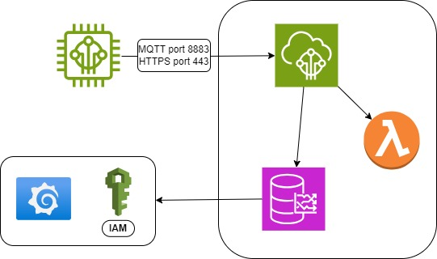
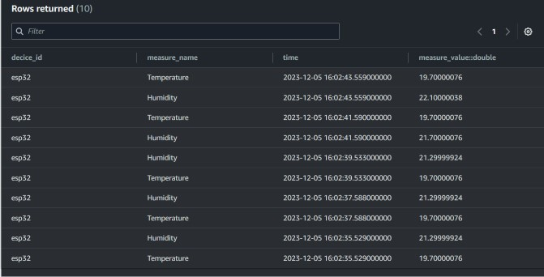
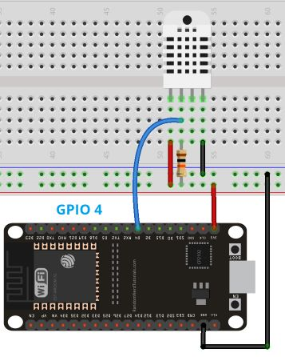
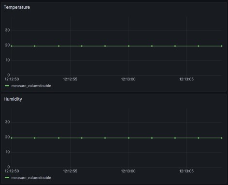

# STM32TempSensor

Under vintern sjunker temperaturen och luftfuktigheten utomhus såväl som inomhus. Det förändrade inomhusklimatet skapar inte bara obehag för mig, men det påfrestar mina växter avsevärt mycket. Vissa växter verkar ta skada trotts regelbunden bevattning och så mycket dagsljus som dagen tillåter, därför tittar det här projektet på hur temperaturen och luftfuktigheten kan påverka inomhusväxters hälsa.

Från en fysisk Device som består av en DHT22 sensor kopplad till en ESP32 PCB skickas data över WIFI till AWS IoT Core, sen lagras mätvärden i en TimeStream databas. Genom att skapa denna "Device to Cloud"-lösning kan jag samla in temperatur och luftfuktighet inomhus och lagra data i molnet, där jag vidare kan hämta data och skapa grafer i visualiseringsverktyget Grafana. 

### _Hårdvaru-komponenter:_

- DHT22 (AM2302)
- ESP32 micrococtroller med WIFI
- 10 kOhm resistor
- Strömkälla (USB kabel)
- Jumperkablar

### _Kopplingsschema:_

- (+) 3.3V pin till DHT22 pin 1
- (-) GND till DHT22 pin 4
- GPIO D4 med 10kOhm resistor till DHT22 pin 2
- DHT22 pin 3 är inte kopplad

### _Mjukvarukomponenter:_
- Arduino IDE
- AWS IoT Core
- DynamoDB
- TimeStreamDB
- Grafana

### _Databasen:_

### _Grafana:_

### Motgångar och hinder

Tanken var att kunna låta min Device mäta och skicka data till AWS utan att vara inkopplad i datorn, men jag fick inte strömvörsörjningen att fungera. 

I AWS stötte jag på hinder med DynamoDB region

Lambda funktion 